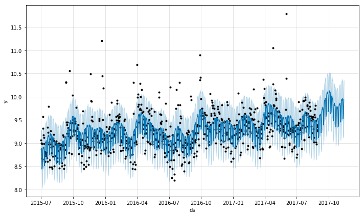

## Kaggle's "Web Traffic Time Series Forecasting" Competition

This model is my solution to Kaggle's "Web Traffic Time Series Forecasting" Competition. It makes web traffic predictions using [Facebook's Prophet package](https://github.com/facebook/prophet).

### Introduction

The competition asked participants to predict web traffic of 145,000 Wikipedia articles given actual web traffic data from the prior two years.

The competition consisted of two rounds. The first round was a preliminary round that lasted for several months for model training and testing. In this round, the predictions were made for a period in the past (i.e., training data from mid 2015 through 2016 was used to make predictions for the first three months in 2017). The second round lasted just one week, and the predictions from this round were for future dates (i.e., training data from the first round plus additional data from the beginning of 2017 was used to make predictions for September 2017 through November 2017). Final scores and rankings will be based on predictions from the second round only.

For more detailed information, please visit the [competition website](https://www.kaggle.com/c/web-traffic-time-series-forecasting).

### Model Analysis

Prophet makes predictions on time series data by combining three distinct components: a linear or logistic trend, a weekly seasonal component, and a yearly seasonal component. 

As an example, actual and forecast web traffic of Elon Musk's Wikipedia page is shown below. The black dots are the article's actual web traffic and the dark blue line is the forecast.

The forecast is made from aggregating the three components that are shown below.

- The trend line reveals that there's been an significant rise in interest in Elon Musk over the past few years
- The weekly graph reveals that interest is high during the weekdays, yet it wanes during the weekends
- The shape of the yearly seasonality is likely related to his company's earnings and product announcements as well as his interactions with the public

### Implementation

Run the **web_traffic_forecasting_model.py** file.

*Note: Prophet can only make predictions for a single time series. Therefore, to obtain predictions for all 145,000 websites, it is necessary to loop through each individual website, which takes a very long time. On my MacBook Pro, the model took about four days to finish.*

Due to space limitations on Github, I do not include the input data files. To run the model, you will need to [download] (https://www.kaggle.com/c/web-traffic-time-series-forecasting/data) and save the two input files (i.e., train_2.csv and key_2.csv) to the same directory as the model file.