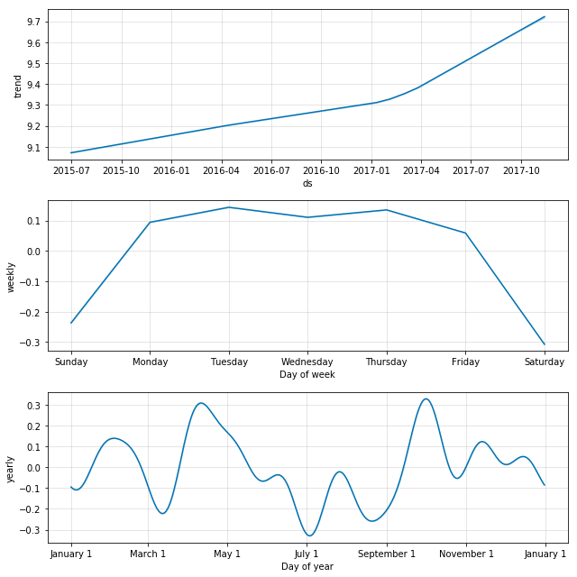

## Kaggle's "Web Traffic Time Series Forecasting" Competition

The output of this model is my submission to Kaggle's "Web Traffic Time Series Forecasting" Competition. It makes web traffic predictions using Facebook's [Prophet](https://github.com/facebook/prophet).

### Introduction

The competition asked participants to predict daily web traffic of about 145,000 Wikipedia articles, and I thought it would be a great opportunity to apply Prophet to an interesting problem.

The competition consisted of two rounds.

The first round lasted for several months. It was a preliminary round that was used for training and testing of models. The predictions that are made are actually for a period in the past (i.e., training data from mid 2015 through 2016 is used to make predictions for the first three months in 2017).

The second round lasted only a week. Here your predictions are made for future dates (i.e., training data from the first round plus some additional data from the beginning of 2017 are used to make predictions for September 2017 through November 2017). Final scores and rankings will be based on predictions made in the second round only.

For more detailed information including rules and guidelines, please visit the [competition website](https://www.kaggle.com/c/web-traffic-time-series-forecasting).

### Prophet

### Implementation

Run the **web_traffic_forecasting_model.py** file that is included in this repository.

*Note: Prophet can only make predictions for a single time series. Therefore, to obtain predictions for all 145,000 websites, it's necessary to loop through each individual website. This takes a very long time, and on my MacBook Pro, the model took about 4 days to finish.*

Due to space limitations on github, I only include the model file. However, to run the model, you also need to download and save the two input files to the same directory as the model file. You can download those files [here](https://www.kaggle.com/c/web-traffic-time-series-forecasting/data).

### Input files for the second round

The following data files are required:
- train_2.csv
- key_2.csv

### Output file for the second round

There is only one output file, which is the submission file:
- submission_2.csv